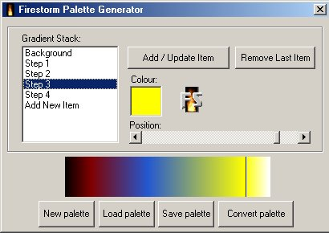



## Firestorm Palette Generator

### Description

This utility creates gradient palettes for the ever popular <a href="http://www.planetsourcecode.com/vb/scripts/ShowCode.asp?lngWId=1&txtCodeId=22769">Firestorm 1.5!</a>(Will only work with v1.5 so download it now...) You can save and load files in a multitude of formats and it has a cool interface! Download it NOW!
 
### More Info
 

             |
---                |---
**Submitted On**   |2001-04-30 18:17:58
**By**             |[Michael Pot&\#232;](https://github.com/Planet-Source-Code/PSCIndex/blob/master/ByAuthor/michael-pot-232.md)
**Level**          |Advanced
**User Rating**    |5.0 (30 globes from 6 users)
**Compatibility**  |VB 4\.0 \(32\-bit\), VB 5\.0, VB 6\.0
**Category**       |[Graphics](https://github.com/Planet-Source-Code/PSCIndex/blob/master/ByCategory/graphics__1-46.md)
**World**          |[Visual Basic](https://github.com/Planet-Source-Code/PSCIndex/blob/master/ByWorld/visual-basic.md)
**Archive File**   |[Firestorm 190314302001\.zip](https://github.com/Planet-Source-Code/michael-pot-232-firestorm-palette-generator__1-22814/archive/master.zip)

